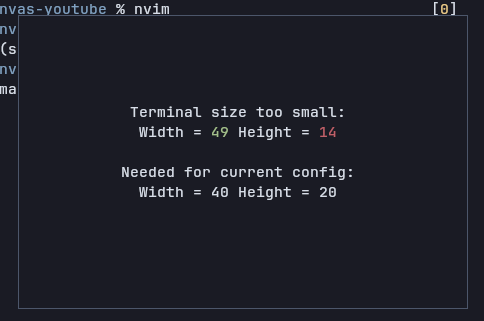

# ccanvas-saver

Screen saver for ccanvas - draws an overlay and suppress all input events to components.



Inspired by the screen saver from **[`btop`](https://github.com/aristocratos/btop)**.

## Do I need a screen saver?
- If your app can't handle extreme small terminal sizes: *yes, you need a screen saver!*
- If your app is designed for a reasonably large terminal: *yes, you need a screen saver!*
- If your app can handle all terminal sizes, and you are confident that it can remain functional even if the terminal is extremely small: *no, you don't need a screen saver!*

## Usage

Make sure that `ccanvas-saver` is installed. For example using the `cargo install` command.

```sh
cargo install --git https://github.com/ccanvas/ccanvas-saver
```

Add it to your program, make sure that feature `saver` is enabled in `libccanvas`.

```rs
// there is no particular order you have to do these things
// client.enable_saver() simply sets a variable in master space, which can be read by the saver component
tokio::join!(
    // spawn in the saver, make sure it is spawned into the master space
    client.spawn("saver".to_string(), "ccanvas-saver".to_string(), Vec::new()),
    // enable saver with a minimal screen size
    client.enable_saver(40, 20),
);
```

### Behaviour

`ccanvas-saver` suppresses events at priority 10, so any subscriptions with a lower priority than that will not receive input events when the screen saver is on.

However, **non-input events**, such as messages and value changes will still be received by components. To avoid drawing on top of the overlay, you can use the following code to check whether the overlay is currently being drawn.

```rs
let is_on = client.saver_ison().await;
```
